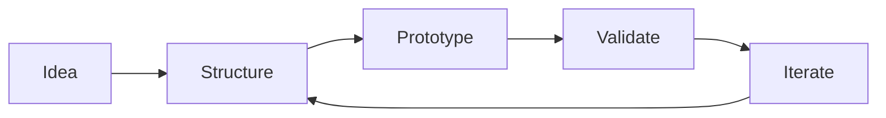

# Hi, I'm Miles 👋

### Smile, smile. Miles.

I turn ideas into working products.

I'm interested in the intersection of **Product, AI, HCI, and Software** — especially in turning ambiguous problems into things people can actually use.

## About me

- 💻 Computer Science
- 🧩 Interested in Product, AI, HCI, and Software
- 📚 Currently building **Bookaive**
- 🛠️ I enjoy going from idea → structure → prototype → validation
- ✍️ I write about projects, ideas, and things I learn

## Current Project

### 📚 Bookaive
A reading archive and resurfacing app for saving meaningful passages and thoughts, then bringing them back at the right time.

## How I Build

## Languages & Tools

### Core

### Used / Explored

### Tools

### Currently Exploring

## GitHub Stats

  

---

> Building, learning, and making things happen.
